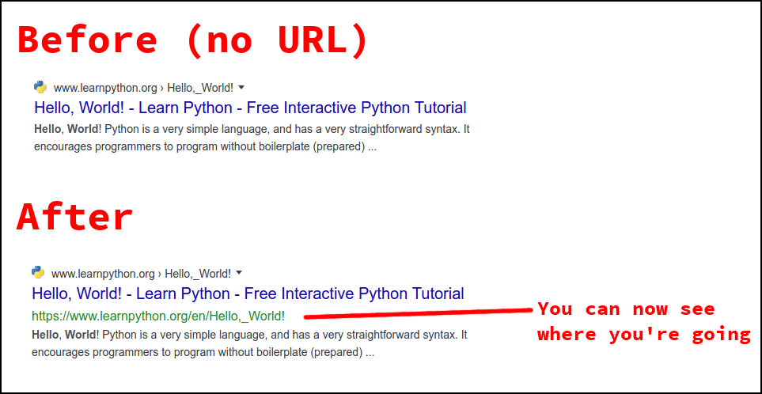

# Google Show Me URLs

Google stopped showing URLs in the search engine results, making it difficult to understand what you're clicking on. It's hard to find specific sites from a description of the page in the `title` elements.

This browser extension brings URLs back to Google's search results pages so that you can safely see where you're going.



## Download

- [Firefox Version](https://addons.mozilla.org/en-US/firefox/addon/search-engines-show-me-urls/)
- Chrome Version -- Google rejected it from the Google Chrome extension store as "spam". Hopefully, it will be online there soon.

## Development

See the `package.json` file. Run `npm start` to launch it in a browser with live-reload.

## Releases

Update the version in `package.json` and `manifest.json` when releasing a new version.

Also tag the version before publishing:

```text
$ git tag -a v0.1.3
```

This will create a new release on Github:

```text
$ git push origin master --tags
```

This will build the extension for both Firefox and Chrome:

```text
$ npm run build
```
